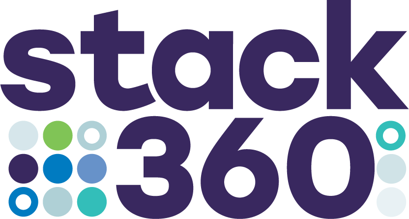

# STACK360 Web-based Business Process Software

Comprehensive Business Process Software for Service-oriented Organizations.

****This repository contains a snapshot of the source code as it existed on May 7, 2024 (excluding customer-specific code).
A book detailing the system's internals has also been published on Amazon.
Since that date, the system has undergone many enhancements and is in production use on a daily basis.
However, due to lower-than-anticipated interest in the open-source code, a decision has been made, at least 
for the time being, not to update this repository.
Please feel free to contact me if you would like the latest version of the system or require support.**

We are pleased to introduce Stack360, our robust web-based business process software. 
Stack360 has been a trusted solution in production for over a decade, providing a suite of integrated functions 
specifically designed for service-oriented organizations. This comprehensive system optimizes various business 
operations, including:

* Applicant Tracking: Automate your recruitment process.
* Human Resources Management: Effectively manage your workforce.
* Project Management: Ensure your projects remain on schedule and within budget.
* Worker Time Tracking: Seamlessly integrate worker hours with payroll and client billing.
* Customer Relationship Management: Oversee sales prospects and client relationships.
* Client Invoicing: Optimize the client billing process.
* Employee Benefit Administration: Administer employee health benefits, insurance, time-off, and more.
* And much more...

Stack360 is also described at [Stack360.io](https://stack360.io)

This repo contains the primary desktop front-end.  Other repos have
the back-end, various other front-ends, and documentation.

### Technical Specifications:

- Back-end
    - Java & Groovy
    - SQL Database
    - SOAP & REST Services
    - microservices 
    - cloud or in-house
    - Linux or Windows
- Front-end
    - HTML/CSS
    - JavaScript
    
Stack360 also utilizes the KISS Open-source Web Development Framework [kissweb.org](https://kissweb.org)

### System Scale:

Stack360's extensive infrastructure comprises more than 8,000 Java and Groovy classes, 300 HTML screens, 
and 270 SQL tables. This system can support organizations of nearly any size.

### Communications:

Stack360 is capable of sending and receiving both email and text messages. 
Additionally, Stack360 features several bidirectional interfaces, including REST, XML, CSV, EDI, SFTP, 
and SOAP, enabling seamless communication with any external system.

### Open-Source Licensing:

The complete source code of Stack360 is now available under the GNU
General Public License Version 3, inviting developers and businesses
to contribute to and benefit from this robust tool.

### Full System Documentation

Through Amazon, we published the 
[Stack360 System Manual](https://amazon.com/dp/B0D1245Q1F).  
This manual documents the architecture of the system,
acts as a developer guide, and covers system configuration.

### Docker Image

We also offer the complete system as a Docker image, which can be accessed at the following link:
[https://hub.docker.com/r/blake1024/stack360](https://hub.docker.com/r/blake1024/stack360)

These images provide a convenient and efficient method for quickly deploying the system for evaluation purposes. 
However, please note that these images are not designed for development or production use. This repository serves 
that purpose.

### Getting Started

This front-end requires the back-end which is located at 
[https://github.com/blakemcbride/Stack360-Backend](https://github.com/blakemcbride/Stack360-Backend).
Full instructions are available there.

### Commercial Support and Licensing:

If you are interested in commercial support or special licensing, please feel free to contact us.  We are committed to 
assisting you in the seamless integration of Stack360 into your business.  For more information, please visit our 
website at [stack360.io](https://stack360.io)

### Join the Stack360 Community

Engage with a growing community of developers and businesses who are
leveraging Stack360 to enhance their operational efficiency.  Your
insights and contributions can help shape the future of
Stack360. Together, let's drive innovation and excellence in business
process management.

Please consider supporting this project at
[https://www.gofundme.com/stack360](https://www.gofundme.com/stack360)

For more information, please contact:

Blake McBride
Email: blake@stack360.io

Join us in this exciting new chapter for Stack360!

The home for this project is [https://github.com/blakemcbride/Stack360-Frontend](https://github.com/blakemcbride/Stack360-Frontend)
